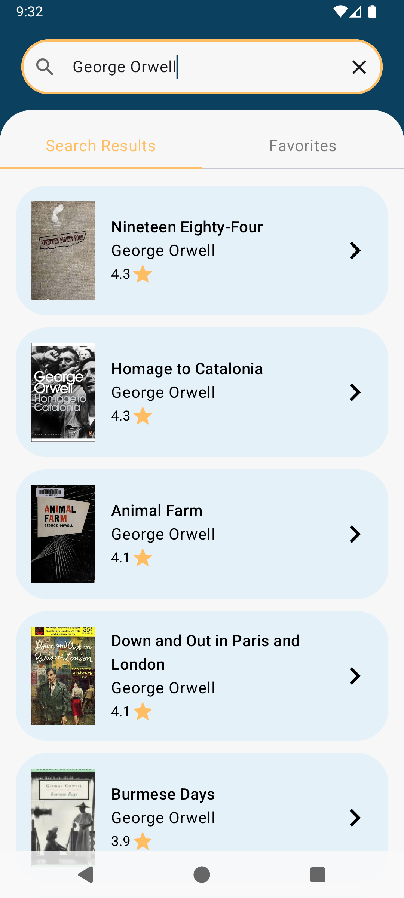
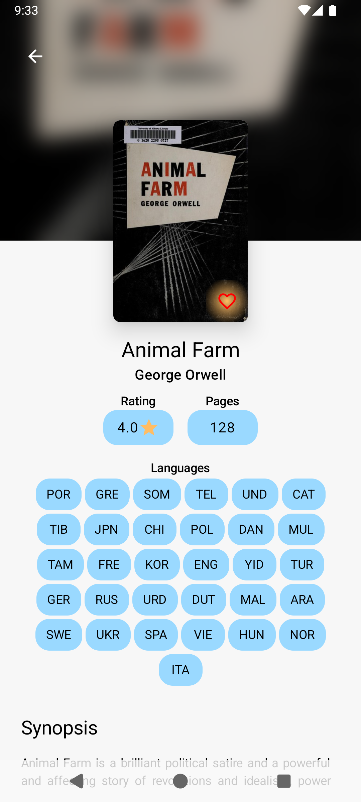

## Overview
Simple Book listing app where users can search for books on public API (https://openlibrary.org/) and add as favorites on device local database.

 

  
&nbsp; &nbsp; &nbsp; &nbsp;
  

## Tech Stack
- Usecases: Search Books and mark them as Favorites using CRUD (Create, Read, Update and Delete) on local database
- Programming Language: Kotlin
- Ui development: Compose Multiplatform
- Dependency Injection: Koin
- Persistance: Local Database (Room)
- Asynchronous requests: Ktor 3.0 and Coroutines + Flow
